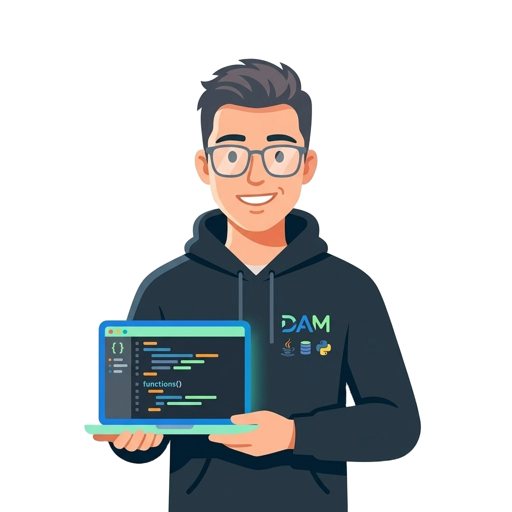
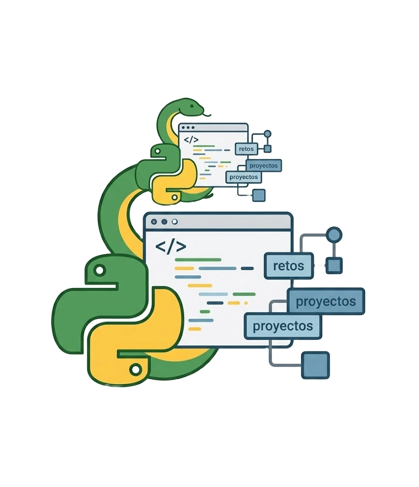

  <h2> 
  ¡Hola, soy Antonio Nicolás! 👋
  </h2>

## 🚀 Mi Ruta en DAM 1.0

> **Status:** `Compilando mi futuro...` ⚙️
> 
> **Ubicación:** `localhost:8080` | Entre Java y Python 🍵
> 
> **Progreso de Grado:**  🛠️

Actualmente estoy sumergido en el mundo del **Desarrollo de Aplicaciones Multiplataforma**. Mi día a día consiste en convertir lógica en algoritmos, pelearme con el punto y coma en Java y diseñar bases de datos que tengan sentido.

* 🔭 **Actualmente trabajando en:** Perfeccionar mi lógica de programación y POO.
* 🌱 **Aprendiendo:** Java puro y gestión de datos con SQL.
* ⚡ **Dato curioso:** Mi primer contacto con el código fue Python, y aunque ahora mi "jefe" es Java, sigo haciendo scripts por pura diversión.

## Tecnologías:

## Mis proyectos de clase y personales:

Como estoy en mi primer año, aquí iré subiendo las prácticas más interesantes y mis experimentos con Python:

<table style="width:100%">
  <tr>
    <td width="50%">
      
      
<b>Ejercicios de Java</b> Prácticas de Programación de 1º de DAM.

    </td>
    <td width="50%">
      
      
<b>Retos de Python</b> Scripts y pequeños proyectos por cuenta propia.

    </td>
  </tr>
</table>

## Contacto:

---
*Este perfil se irá actualizando a medida que avance en mi grado superior. ¡Gracias por pasarte!* 😊
